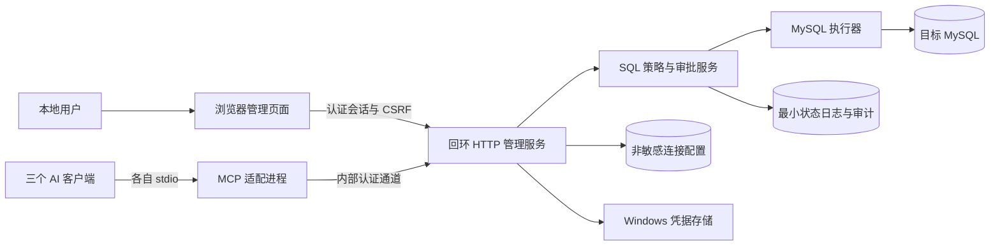
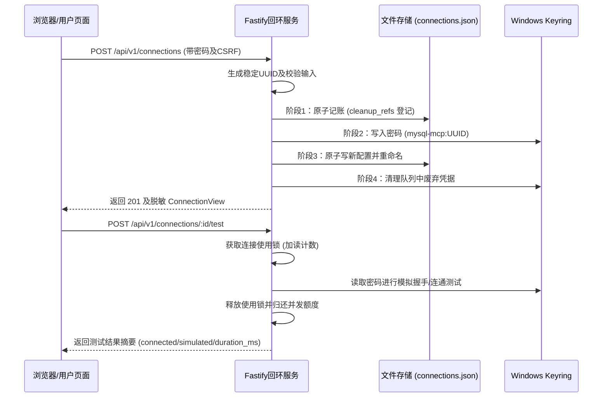
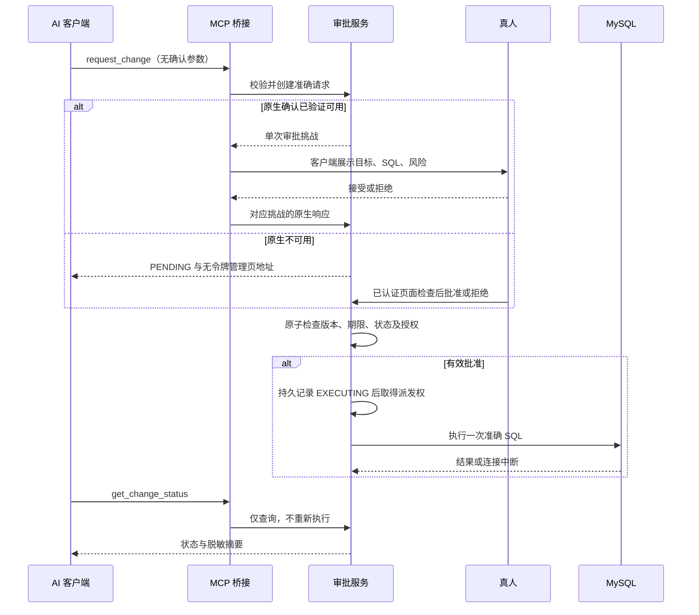
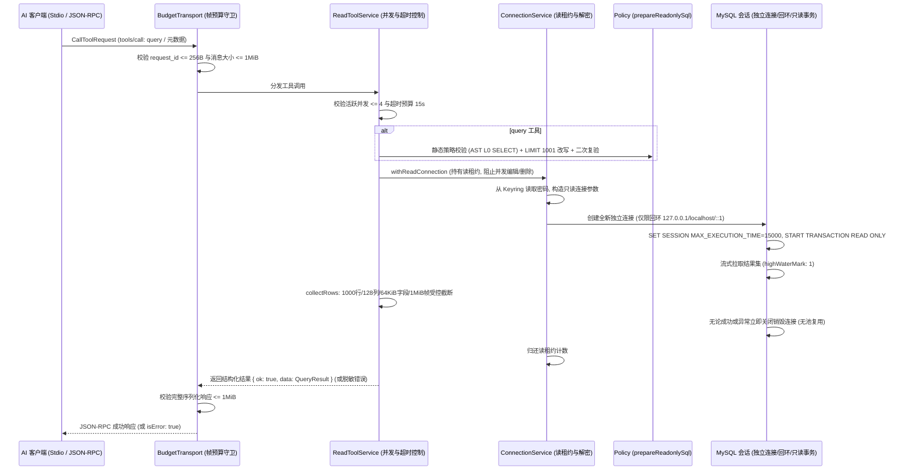

# 系统架构

> 状态：拟采用方案，全部组件尚未实现。安全规则见[项目约束](./PROJECT_CONSTRAINTS.md)，契约见[接口](./API_AND_PROTOCOLS.md)。

## 1. 拓扑与职责



| 层 / 物理路径 | 责任 Agent | 责任 | 禁止 |
|---|---|---|---|
| web (`mysql-mcp/web/`) | Antigravity | 展示、输入、人工确认、设计系统与交互反馈 | 直接连 MySQL、存密码到 Web Storage、编写后端服务 |
| server/routes (`mysql-mcp/src/server/`) | PI-Desktop | 认证、结构校验、协议映射、回环监听 | 自建第二套审批逻辑、修改前端页面资产 |
| mcp (`mysql-mcp/src/mcp/`) | PI-Desktop | 工具适配、原生确认桥接、Stdio 协议 | 持有数据库密码、直接执行 SQL |
| approval (`mysql-mcp/src/sql/`) | PI-Desktop | 请求绑定、原子状态迁移、AST 策略判定、执行授权 | 将模型声明视为用户批准 |
| db (`mysql-mcp/src/db/`) | PI-Desktop | 分类、目标验证、连接池管理、资源控制、执行 | 自动提权、写入自动重试 |
| config/security/audit (`mysql-mcp/src/security/`) | PI-Desktop | 配置、Windows Keyring 凭据、脱敏、最小审计 | 将秘密写入普通文件 |

全栈物理隔离与分工详见[全栈分工规范](./FULLSTACK_DIVISION_SPECIFICATION.md)。依赖方向为入口→业务→基础设施，MCP 与 HTTP 共用同一业务服务。管理服务是单实例配置写入者；第二个实例启动应明确报错，不争抢状态文件。

## 2. 认证与秘密流向（Phase 2-A 落地实现）

1. **本地回环 Fastify 服务**：
   - 严格仅绑定 `127.0.0.1`，禁止监听外部网卡；
   - 强校验 `Host`（仅允许 `127.0.0.1:<port>` 或 `localhost:<port>`）与 `Origin`（强制同源），跨域外网请求直接 403 阻断；
   - 身份认证：通过控制台输出的 32 字节高熵随机 HEX 本地码（`local_code`）换取会话，单次使用、5分钟过期；限速每分钟最多 10 次尝试；
   - 会话与防 CSRF：基于内存管理（最多 16 会话，TTL 30 分钟），通过 `Set-Cookie: HttpOnly; Path=/; SameSite=Strict` 保持；所有状态变更请求校验 `x-csrf-token`；
2. **秘密绝不上浮**：
   - 密码仅通过页面 POST/PATCH 请求体直达服务端内存，随即写入 Windows Keyring；
   - 所有接口响应（连接列表、连接详情、错误消息）绝对剔除 `password` 与内部 `credential_ref`；
   - 错误响应统一通过安全错误白名单脱敏，严禁泄漏操作系统路径或原生数据库堆栈；
3. **威胁边界**：
   - 本地服务与 Keyring 无法抵御同一 Windows 用户上下文下的恶意进程；此安全边界公开披露。

## 3. 连接管理与存储架构（Phase 2-A 落地实现）



1. **单写者文件存储 (`JsonMetadataStorage`)**：
   - 独占式排他创建 `.lock` 租约文件，防止双实例并发冲突；服务正常退出时自动删除 `.lock`；
   - 写入采用带 UUID 的临时文件 (`.tmp`)，经 `file.sync()` 强制落盘后，通过原子重命名（`rename`）覆盖原目标文件；
   - 故障关闭：若写入失败，原有配置完好无损；
2. **并发控制与连接锁**：
   - 读写互斥与使用锁：连接在测试执行期间持有活跃计数；若此时收到编辑或删除请求，服务端返回 `409 STATE_CONFLICT` 拒绝冲突操作；
   - 乐观并发控制：编辑与删除必须提供 `expected_version`，与当前配置版本一致才允许推进。

## 4. 写入与双通道确认



原生显式拒绝/取消为终态，不转网页重新尝试。原生协议未支持时可选择网页；如果挑战已发出但通道故障，应先撤销挑战并确保无法迟到批准，再切换，无法保证则取消请求重新申请。

## 5. 并发、故障及重启

- 请求 SQL、目标、连接版本冻结；所有审批入口争抢同一次原子状态转换。过期、资料变化、断开的请求不得启动执行。
- 执行期间锁住该连接的编辑/删除；不持有用户长时间审批等待期间的 MySQL 事务或行锁。
- SQL 内存保存；持久状态日志在派发前记 EXECUTING。重启将遗留 EXECUTING 标为 UNKNOWN，其他非执行等待请求失效；绝不重放 SQL。
- 如果状态日志无法可靠落盘，不开始写操作。日志写入成功但 SQL 尚未派发时崩溃，也可能保守报告 UNKNOWN，这是不承诺恰好一次的原因。
- 服务中断后 MCP 返回不可用或已有未知状态，不自动启动多个服务、不再次提交写请求。
- 执行取消需要处理驱动和服务端实际状态；关闭连接不等于服务器没有提交。结果不确定时通知用户向 DBA 核对。

具体字段和转换以[数据模型](./DATA_MODELS.md)为准。内部通道实现、文件锁和 Windows 原子持久化行为需测试，以上不是通过证据。

---

## 6. Phase 3 落地核心模块与物理边界

在 `mysql-mcp/src/` 中，系统已落地完整的 Phase 3 受限读取与 MCP 工具执行服务层，形成自顶向下的严格防线：

```text
mysql-mcp/src/
├── index.ts               // 顶层导出聚合器（惰性重新导出工厂与类型，不产生自发网络/服务副作用）
├── security/
│   └── keyring.ts         // Windows Credential Manager 异步系统凭据封装 (ICredentialProvider / WindowsKeyringProvider)
├── server/
│   ├── app.ts             // Fastify 本地回环 HTTP 服务工厂 (createLocalServer)
│   ├── auth.ts            // 32 字节高熵本地代码认证、内存 Session 与 CSRF 令牌管理
│   ├── connections.ts     // 原子文件元数据持久化、多读者并发读租约 (withReadConnection) 与测试使用锁
│   ├── errors.ts          // 服务端错误类与安全消息白名单映射
│   └── routes.ts          // REST API 路由注册
├── sql/
│   ├── ast.ts             // 词法分号预查、node-sql-parser 解析适配与资源上限硬阈值
│   ├── policy.ts          // L0~L3 风险分级矩阵、白名单校验器、指纹与摘要计算 (evaluateSql)
│   ├── readonly.ts        // 只读 SQL 校验、LIMIT 1001 哨兵改写与 AST 二次复验 (prepareReadonlySql)
│   ├── results.ts         // 1000行/128列/64KiB单字段/1MiB整帧预算收集与受控截断 (collectRows, responseBytes)
│   ├── driver.ts          // 逐请求独立 MySQL 只读会话工厂、流式拉取与 hex 元数据绑定 (mysqlReadSession)
│   └── read-errors.ts     // 驱动异常安全映射白名单与脱敏错误 (ReadError, readError, databaseError)
└── mcp/
    ├── server.ts          // MCP Server 工厂 (createMcpServer / startStdioServer)，工具分发与优雅关闭
    ├── tools.ts           // 5 个受限读取工具定义、严格 Schema 校验与服务分发 (ReadToolService)
    └── transport.ts       // 传输层预算守卫：请求 ID <= 256B、完整帧 <= 1MiB (BudgetTransport)
```



### 7. 架构安全边界与内存/执行局限说明

1. **输出截断不等于底层进程硬内存上限**：
   - 驱动层（`mysql2`）在将数据包派发给流之前，首先在内部解码接收到的单包/单行；
   - 本系统所施加的 1000 行、128 列、64KiB 单字段以及 1MiB 编码后完整 MCP 帧上限，属于应用服务层的输出与传输保护预算，**并不构成操作系统进程级别接收外部单包的物理硬内存上限**。
2. **连接超时销毁不证明远端服务端立即终止执行**：
   - 当达到 15 秒预算或客户端取消操作时，服务端通过 `connection.destroy()` 立即断开并销毁本地套接字，主动归还并发插槽与读租约；
   - 尽管会话配置了 `SET SESSION MAX_EXECUTION_TIME`，但在高负载或复杂执行计划下，本地套接字销毁**并不等价于远端 MySQL 服务端内部已立刻停止扫描或完全释放远端资源**。
3. **零跨库与纯单会话隔离**：
   - 数据库目标沿用已验证 AST 库名子集（ASCII 标识符且严格大小写匹配）；跨库访问确定性返回 `SQL_NOT_ALLOWED`；
   - 元数据超限直接返回 `RESOURCE_LIMIT`，坚决不提供假分页或虚假宣称完整。
4. **回环目标限制**：
   - 默认 MySQL 适配当前硬性限制仅允许回环地址（`127.0.0.1`、`localhost`、`::1`），远程目标在 TLS 证书策略冻结前直接返回 `SERVICE_UNAVAILABLE`。

