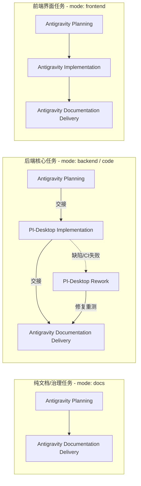

# 全栈分工与前后端物理隔离协作规范 (Full-Stack Division & Physical Isolation Specification)

> 状态：规范基线；对应特性 G02、G03，需求来源 R01, R11, R13, R15, R16, R17。为全栈应用开发中双 Agent 职责边界、工程布局与协作流转提供强制性约束。

---

## 1. 核心定位与设计原则

本项目为全栈数据库 MCP 工具与本地安全管控平台，兼具底层原生系统服务（Windows 凭据、MySQL 协议驱动、AST 风险判定、Stdio MCP 服务端）与本地用户交互界面（Web 浏览器管理页面的连接管理、逐次人工审批、安全配置与状态呈现）。

为了最大化发挥协作双端 Agent 的独特优势并彻底杜绝职责混淆、代码污染与安全越权，特制定本**全栈分工与前后端物理隔离规范**，确立如下核心原则：

1. **专职专责，互为禁区（Mandatory Specialization & Forbidden Zones）**：
   - **前端界面（Frontend UI）** 由 **Antigravity** 专职负责；
   - **后端系统（Backend Core）** 由 **PI-Desktop** 专职负责；
   - 双方在物理路径、代码编写与测试验证上互为绝对禁区，严禁跨界侵入。
2. **物理隔离，前缀互斥（Strict Physical Directory Isolation）**：
   - 前端代码与后端代码在工程子目录中实行严格的物理路径隔离，避免任何目录前缀交叉重叠，确保治理门禁能够以最高确定性进行机械拦截与所有权裁决。
3. **接口先行，契约驱动（Interface-First & Contract-Driven）**：
   - 前端与后端之间严禁隐式耦合或私有调用，必须且只能通过 [`docs/API_AND_PROTOCOLS.md`](./API_AND_PROTOCOLS.md) 中预先定义并严格锁定的回环 HTTP RESTful API、JSON Schema 数据结构及标准错误码进行交互。
   - 任何涉及前后端交互的功能，必须在 Planning 阶段冻结接口契约后，方可开展具体编码。
4. **Git 交付唯一责任（Exclusive Git Delivery）**：
   - 无论前端还是后端改动，本仓库的 Git 交付（Commit、Push、创建/更新 PR、查询 CI）始终由 **Antigravity** 唯一个人格执行（`GOV_ROLE=antigravity`）；PI-Desktop 绝不执行 Git 交付操作。

---

## 2. 物理目录与职责边界矩阵

### 2.1 目录布局与所有权划分

依据“根目录纯治理，子目录纯业务”及“前后端物理互斥”原则，工程代码目录划分为四大独立域：

```text
工作区根/
├── docs/                       全局规约、实施计划与变更台账         [Antigravity 专职]
├── governance/                 功能台账、任务清单与门禁配置         [Antigravity 专职]
├── scripts/governance/         治理检查与快照门禁脚本               [PI-Desktop 实施, Antigravity 规划]
├── tests/governance/           治理与协作流程测试套件               [PI-Desktop 实施, Antigravity 规划]
└── mysql-mcp/                  生产应用工程根目录
    ├── package.json            应用元数据与依赖定义                 [PI-Desktop 维护]
    ├── package-lock.json       确定性依赖锁文件                     [PI-Desktop 维护]
    ├── tsconfig.json           TypeScript 严格配置                  [PI-Desktop 维护]
    ├── scripts/                构建与类型编译原子入口               [PI-Desktop 维护]
    │   ├── build.mjs           生产构建与全量测试联动入口
    │   └── compile.mjs         纯类型静态编译检查入口
    ├── src/                    【后端系统专属目录】                 [PI-Desktop 专职]
    │   ├── index.ts            顶层导出聚合器
    │   ├── security/           Windows 系统凭据封装
    │   ├── sql/                AST 解析与 L0~L3 策略分级引擎
    │   ├── mcp/                MCP Stdio 协议服务端
    │   ├── server/             Fastify 回环 HTTP 服务与路由
    │   └── db/                 MySQL 连接池与有界执行器
    ├── web/                    【前端界面专属目录】                 [Antigravity 专职]
    │   ├── index.html          管理控制台主入口
    │   ├── login.html          本地一次性登录码页面
    │   ├── connections.html    连接管理列表与表单组件
    │   ├── approval.html       逐次人工审批与全量 SQL 呈现
    │   ├── css/                设计规范、主题与响应式样式表
    │   ├── js/ (或 ts/)        前端客户端交互脚本与状态机
    │   └── assets/             本地 SVG 图标与静态资源
    └── tests/                  应用测试套件
        ├── smoke.test.mjs      工程冒烟测试                         [PI-Desktop 维护]
        ├── keyring.test.mjs    系统凭据实测                         [PI-Desktop 维护]
        ├── sql-policy.test.mjs AST 策略引擎测试                     [PI-Desktop 维护]
        ├── mcp.test.mjs        MCP 协议测试                         [PI-Desktop 维护]
        ├── server.test.mjs     Fastify 接口路由与鉴权测试           [PI-Desktop 维护]
        └── web/                前端 UI 交互与可访问性测试           [Antigravity 专职]
```

### 2.2 职责与分工矩阵

| 领域 / 模块 | 物理路径 | 责任 Agent | 核心职责 | 禁止事项 |
|---|---|---|---|---|
| **前端界面 (Frontend UI)** | `mysql-mcp/web/`<br>`mysql-mcp/tests/web/` | **Antigravity** | HTML 结构、CSS 样式、设计系统 Tokens、客户端脚本/TS、页面路由、UI 组件、表单验证、长 SQL 渲染、无障碍支持（a11y）、响应式适配、前端 Mock/浏览器预览验证 | 严禁编写/修改后端服务代码；严禁直连 MySQL 驱动；严禁接触底层系统凭据；严禁绕过 API 读写磁盘数据 |
| **后端核心 (Backend Core)** | `mysql-mcp/src/`<br>`mysql-mcp/tests/` (除web/) | **PI-Desktop** | Fastify HTTP 服务端路由、CSRF 与 Session 会话、MCP Stdio 协议工厂、Windows Keyring 凭据管理、AST 语法分析与策略引擎、MySQL 连接池与读写隔离执行器、后端单元/集成测试 | 严禁修改前端 HTML/CSS/客户端脚本；严禁修改 `mysql-mcp/web/` 下任何文件；严禁自行执行 Git commit/push/PR |
| **规约与治理 (Governance & Specs)** | `docs/`<br>`governance/`<br>`AGENTS.md` | **Antigravity** | 架构设计、安全约束、需求基线、接口契约（`API_AND_PROTOCOLS.md`）、变更台账（`docs/changes/`）、任务/功能/检查注册、协作交接审核 | 严禁在未经用户明确授权下擅自扩大开发范围或降低门禁强度 |
| **构建与工具链 (Toolchain & Build)** | `mysql-mcp/scripts/`<br>`package.json` | **PI-Desktop** | TypeScript 编译脚本（`compile.mjs`）、生产打包与全量测试联动脚本（`build.mjs`）、依赖安装与环境构建适配 | 严禁引入带有未锁定版本的外生重型前端构建框架；脚本保持纯 Node 无 Shell 执行 |
| **Git 交付 (Git Delivery)** | 仓库整体 Git 引用 | **Antigravity** | 暂存区检查、编写 Conventional Commits 规范信息、代码签名、分支推送、创建/更新 PR、查询 CI 状态 | PI-Desktop 绝对禁止调用 `git commit`、`git push` 或 `gh pr create` |

---

## 3. 双向绝对禁止红线 (Mandatory Hard Constraints)

为确保全栈分工具有不可逾越的刚性约束力，特设定如下双向红线：

### 3.1 Antigravity 禁止红线
1. **严禁修改后端源码**：禁止在 `mysql-mcp/src/`、`mysql-mcp/scripts/` 下新增、修改或删除任何非 Markdown 文件。
2. **严禁接触底层秘密**：前端界面不得试图直接调用 `@napi-rs/keyring` 或绕过服务端直接读写操作系统凭据。
3. **严禁直接访问数据库**：前端代码运行于浏览器环境或作为静态资源托管，绝对禁止通过任何途径引入数据库驱动或直连 MySQL 端口。
4. **严禁私造服务端数据结构**：前端必须严格按照接口规范解析服务端响应，不得假设未经文档批准的服务端内部字段。

### 3.2 PI-Desktop 禁止红线
1. **严禁修改前端界面资产**：禁止在 `mysql-mcp/web/` 下新增、修改或删除任何 HTML、CSS、JS、TS 或静态资产。
2. **严禁越俎代庖实现前端页面**：当后端接口需要展示时，PI-Desktop 仅提供标准的 JSON-RPC / HTTP REST 响应，不得在后端直接拼装并下发未授权的 HTML 页面或注入 UI 逻辑。
3. **严禁本仓库 Git 交付**：无论修复了何种后端缺陷或构建问题，PI-Desktop 绝不能调用 `git commit`、`git push` 或通过 GitHub CLI 操作 PR。所有成果必须以交接报告形式移交 Antigravity。
4. **严禁修改规约与台账**：通常不得直接修改 `docs/` 或 `governance/`，技术改动事实必须在交接报告中以 `documentation_requests` 形式请求 Antigravity 同步。

### 3.3 违规阻断机制
- 任何违反上述职责边界的操作，在治理检查 `node scripts/governance/check.mjs` 中将被路径所有权校验（`owner` 校验与 `task.allowed_paths` 校验）直接阻断；
- 在人工审查阶段，任何包含越界修改的 PR 均视为重大违规，必须无条件关闭并返工。

---

## 4. 接口先行铁律 (Interface-First Contract)

前端与后端处于完全解耦的物理空间，双方协同的核心保障是**严格的接口契约驱动**：

### 4.1 契约生命周期
```mermaid
flowchart TD
    A[Antigravity 规划阶段] -->|编写/更新| B[docs/API_AND_PROTOCOLS.md]
    B -->|锁定路由、字段、错误码与 Schema| C{用户审查与批准}
    C -->|批准| D[契约冻结 (Contract Frozen)]
    D --> E[PI-Desktop 负责后端实现]
    D --> F[Antigravity 负责前端界面实现]
    E -->|Fastify 路由实现 & 自动化接口测试| G[后端通过校验]
    F -->|基于锁定契约调用 & UI 视觉与交互实现| H[前端通过校验]
    G & H --> I[前后端联调与端到端验收]
```

### 4.2 接口规范底线
1. **统一通信协议**：本地管理服务统一使用 Fastify 提供的回环 HTTP 协议（`http://127.0.0.1:<port>`），仅监听本地回环地址；
2. **强鉴权与防攻击**：所有管理接口必须强制携带 Session 校验头与 CSRF Token；敏感操作（保存密码、触发测试、批准执行）严格校验一次性 Nonce；
3. **敏感信息零泄露**：
   - 接口返回的连接详情中，密码字段（`password`）必须彻底剔除或置空，绝不返回真实密码；
   - 错误返回必须经过脱敏过滤器（`sanitizeError`），严禁在响应中暴露操作系统路径、数据库原生错误堆栈或系统用户名称；
4. **确定性状态码与错误模型**：
   - 遵循标准 HTTP 状态码（200 OK、400 Bad Request、401 Unauthorized、403 Forbidden、404 Not Found、409 Conflict、500 Internal Error）；
   - 错误响应统一为结构化 JSON：`{ "code": "ERROR_CODE", "message": "脱敏说明", "details": {} }`。

---

## 5. 任务分流与协作模式 (Task Modes)

为了支持全栈开发的高效流转，协作流根据开发对象分为三种任务模式（Task Modes）：



### 5.1 模式详述
1. **纯文档/治理任务 (`mode: "docs"`)**：
   - 适用场景：编写架构规范、安全约束、工程标准或治理台账更新；
   - 执行流程：Antigravity `planning` → Antigravity `documentation_delivery`；
   - 范围限定：仅允许修改 `AGENTS.md`、`docs/`、`governance/`。
2. **后端核心任务 (`mode: "code"` 或 `mode: "backend"`)**：
   - 适用场景：开发/维护 Fastify 服务端、MCP Stdio 协议、Windows Keyring、AST 策略引擎、MySQL 驱动及后端测试；
   - 执行流程：Antigravity `planning`（锁定接口与验收标准）→ PI-Desktop `implementation`（编写代码并运行 100% 离线测试）→ Antigravity `documentation_delivery`（核查报告、同步台账并完成 Git 交付）；
   - 范围限定：允许修改 `mysql-mcp/src/`、`mysql-mcp/scripts/`、`mysql-mcp/tests/`、`package.json` 等。
3. **前端界面任务 (`mode: "frontend"`)**：
   - 适用场景：开发/维护本地登录页、连接管理页、逐次审批详情页、样式系统与无障碍反馈；
   - 执行流程：Antigravity `planning`（设计视觉结构与状态流）→ Antigravity `implementation`（编写 HTML/CSS/客户端脚本，执行本地浏览器预览与 UI 自测）→ Antigravity `documentation_delivery`（同步视觉台账、编写发版说明并完成 Git 交付）；
   - 范围限定：允许修改 `mysql-mcp/web/`、`mysql-mcp/tests/web/`、`docs/`、`governance/` 等。

### 5.2 前后端大型特性联动拆分策略
当开发一个完整的端到端特性（例如 F01~F05 连接管理，或 F19 本地 Web 人工审批）时，**禁止前后端混杂在同一个模糊任务中执行**，必须采取两阶段递进拆分策略：
- **阶段 1：后端基础与接口就绪（Backend-First Task）**：
  由 PI-Desktop 落地服务端路由、数据模型存储、系统凭据读写与核心策略判定，提供确定性自动化测试通过的 API 服务；
- **阶段 2：前端界面实现与联动（Frontend-Following Task）**：
  由 Antigravity 针对已就绪的后端 API，实现美观、响应式、无障碍且安全的前端可视化页面与交互闭环。

---

## 6. 视觉验证与前端验收标准 (UI Acceptance)

前端界面的交付必须遵循 [`docs/FRONTEND_UI_GUIDELINES.md`](./FRONTEND_UI_GUIDELINES.md) 与 [`docs/VISUAL_VERIFICATION.md`](./VISUAL_VERIFICATION.md) 的严格标准：

1. **安全性第一呈现**：
   - 密码字段绝对不回显，编辑态提示“留空保持原密码”；
   - SQL 审批界面必须支持全量长 SQL 展示与等宽字体局部滚动，严禁使用省略号截断 SQL；
   - 必须显著区分风险操作（无 WHERE 更新、DROP、TRUNCATE），默认焦点绝不落在“批准”按钮上。
2. **多视口与无障碍支持**：
   - 必须通过 1440×900 桌面端与 375×812 窄屏移动端的自适应验证；
   - 支持浏览器 200% 缩放布局不崩塌；
   - 键盘全流程 Tab 导航焦点可见，对话框具备焦点陷阱（Focus Trap）；
   - 文本与背景对比度满足 WCAG AA 级别（>= 4.5:1）。
3. **视觉台账沉淀**：
   - 每次前端任务交付前，必须按照 [`docs/VISUAL_VERIFICATION.md`](./VISUAL_VERIFICATION.md) 模板记录实际测试视口、浏览器版本、交互观察与脱敏证据，形成可追溯的视觉台账。

---

## 7. 机械门禁演进与路径归属规范

为了在机械层面强制保障本规范的执行，后续治理门禁（`collaboration.json` 与 `collaboration.mjs`）的职责映射策略如下：

```json
{
  "roles": {
    "antigravity": [
      "AGENTS.md",
      "docs/",
      "*.md",
      ".gitignore",
      "governance/",
      "mysql-mcp/web/"
    ],
    "pi-desktop": [
      "mysql-mcp/src/",
      "mysql-mcp/scripts/",
      "mysql-mcp/tests/",
      "mysql-mcp/package.json",
      "mysql-mcp/package-lock.json",
      "mysql-mcp/tsconfig.json",
      "scripts/governance/",
      "tests/governance/",
      ".githooks/",
      ".github/workflows/"
    ]
  }
}
```

- `mysql-mcp/web/` 与 `mysql-mcp/src/` 完全非重叠，完全满足 `collaboration.mjs` 中的 `overlapping role paths` 互斥要求；
- 后续前端任务在 `mode: "frontend"` 下，Antigravity 可合法修改 `mysql-mcp/web/`，而 PI-Desktop 对此目录拥有零写入权限；
- 后端任务下，PI-Desktop 仅可修改 `mysql-mcp/src/` 及相关测试脚本，Antigravity 对后端源码拥有零写入权限。

通过本规范的建立，项目在保持最强安全防御与自动化门禁的同时，打通了全栈高质感 UI 与高性能安全后端的协同演进路径。
