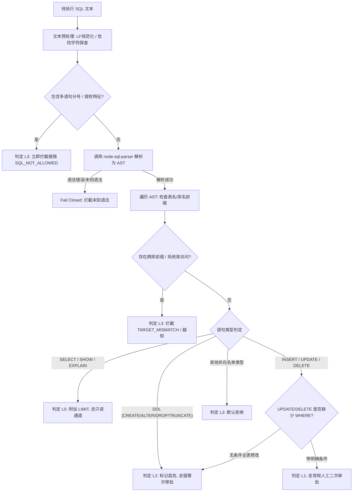

# SQL 语法支持矩阵与风险分级策略规范 (SQL Policy & Risk Matrix)

> 状态：安全策略基线；对应需求 R06、R07、R08、R09，对应特性 F11–F18、F26，提供生产级 SQL 静态分析与动态拦截策略。

---

## 1. 核心设计原则 (Guiding Principles)

1. **零信任与默认拒绝 (Fail Closed by Default)**：
   - 凡是解析器无法完全解析、语法树存在未知节点、或者不在明确放行白名单内的 SQL 语句，**一律直接拒绝执行**，不得心存侥幸予以放行。
2. **显式单目标数据库绑定 (Strict Database Scoping)**：
   - 每次 SQL 执行必须绑定显式声明的目标数据库（`database` 参数），严禁跨数据库访问，严禁利用隐式默认库产生混淆。
3. **防注入与单语句执行 (Single Statement Only)**：
   - 严格禁止在单次请求中派发由分号 `;` 拼接的多条复合语句，彻底杜绝堆叠注入（Stacked Queries）风险。
4. **最小权限与不自动提权 (No Privilege Escalation)**：
   - 应用不持有 DBA 管理凭据，执行受底层 MySQL 用户账号实际权限约束；应用层门禁在语句派发前先行过滤，避免高危指令触碰数据库。

---

## 2. 风险四级矩阵 (Risk Levels Matrix)

系统将所有进入的 SQL 语句经语法树（AST）解析后，划分为四个严格的风险等级：

| 风险等级 | 操作类别 | 允许的典型语句 | 处理策略与门禁行为 | 交互通道要求 |
|---|---|---|---|---|
| **L0 (只读直通)** | 基础只读查询与结构探查 | `SELECT ...`, `EXPLAIN ...`, `DESCRIBE <table>`, `SHOW TABLES`, `SHOW COLUMNS FROM <table>` | **受控直通**：静态校验无写操作、无跨库后，自动附加输出行数截断（默认 1000 行），直接派发只读会话执行 | MCP `query` 工具放行；不可调用变更接口 |
| **L1 (常规受控 DML)** | 带明确条件的业务写入 | `INSERT INTO ... VALUES (...)`, `UPDATE ... WHERE <cond>`, `DELETE FROM ... WHERE <cond>` | **常规二次审批**：检查语法合法性、验证 WHERE 条件存在性、生成准确请求绑定与指纹，挂起等待用户单次审批 | 原生确认或本地 Web 页面确认目标与 SQL |
| **L2 (高危 DML / DDL)** | 全量破坏性修改与库表结构变更 | `UPDATE ...` (无 WHERE), `DELETE FROM ...` (无 WHERE), `CREATE TABLE`, `ALTER TABLE`, `DROP TABLE`, `TRUNCATE TABLE`, `CREATE/ALTER/DROP DATABASE` | **高危双重警示审批**：判定为破坏性/不可逆变更；在审批通道中强制标记 `HIGH_RISK`，醒目提示全表覆写或物理删除影响，必须人工强确认 | 本地 Web 管理页面强制警示交互确认 |
| **L3 (绝对阻断黑名单)** | 跨库、提权、系统交互与未知语句 | 跨库查询、多语句、`INTO OUTFILE`、`LOAD DATA`、`GRANT/REVOKE`、存储过程/触发器、事务控制语句 | **硬性拦截阻断**：严禁派发数据库，返回 `SQL_NOT_ALLOWED`，并记录安全审计事件 | 直接返回错误，拒绝生成任何审批请求 |

---

## 3. L3 绝对阻断黑名单细则 (Prohibited Operations)

以下行为属于系统的**绝对禁止红线**，策略引擎必须无条件拦截：

1. **跨数据库操作拦截**：
   - 若当前绑定的目标数据库为 `demo_db`，SQL 语句中出现任何形如 `other_db.table_name` 或 `information_schema.*`、`mysql.*`、`performance_schema.*`、`sys.*` 的显式库名前缀，一律判定为跨库越权并直接拦截。
2. **多语句堆叠注入拦截**：
   - 语句经过文本标准化（去除首尾空白与合法注释）后，若包含用于语句分隔的分号 `;`，一律拦截。单次请求仅允许且必须是一条独立完整的单语句。
3. **文件系统与外部交互拦截**：
   - 严禁 `SELECT ... INTO OUTFILE` / `INTO DUMPFILE`。
   - 严禁 `LOAD DATA INFILE` / `LOAD XML`。
4. **账号、权限与系统级命令拦截**：
   - 严禁 `GRANT`, `REVOKE`, `CREATE USER`, `DROP USER`, `ALTER USER`, `RENAME USER`。
   - 严禁 `FLUSH PRIVILEGES`, `RESET`, `SHUTDOWN`, `KILL`, `SET GLOBAL`。
5. **存储程序与动态执行拦截**：
   - 严禁 `CREATE PROCEDURE`, `ALTER PROCEDURE`, `DROP PROCEDURE`, `CALL`。
   - 严禁 `CREATE TRIGGER`, `DROP TRIGGER`。
   - 严禁 `CREATE FUNCTION`, `DROP FUNCTION`。
   - 严禁 `PREPARE`, `EXECUTE`, `DEALLOCATE PREPARE`。
6. **用户自管事务语句拦截**：
   - 首期范围不开放客户端自定义长事务；严禁派发 `BEGIN`, `START TRANSACTION`, `COMMIT`, `ROLLBACK`, `SAVEPOINT`, `SET autocommit = ...`。所有受审批的 DML 均作为单次原子操作执行。

---

## 4. AST 语法树解析与策略流向



---

## 5. 安全审计与指纹提取规范

1. **SQL 规范化指纹 (SQL Fingerprint)**：
   - 策略引擎对放行（L0）或待审批（L1/L2）的 SQL 进行标准化指纹计算：
     - 去除无语义多余空白与换行符；
     - 将连续字面量参数进行位置占位归一化（如 `WHERE id = 123` 抽象为 `WHERE id = ?`）；
     - 生成 SHA256 结构指纹。
   - 指纹用于审计去重与防篡改绑定，不用于反推原始敏感业务数据。
2. **审计日志与脱敏原则**：
   - 拦截或审批日志中严禁持久化明文敏感参数内容；
   - 记录要素仅限：`request_id`、`connection_id`、`database`、`risk_level`、`sql_fingerprint`、`decision`、`timestamp`、`error_code`。

---

## 6. `evaluateSql` 引擎实现契约与资源边界

### 6.1 决策对象契约 (`SqlDecision`)
```typescript
export interface SqlDecision {
  readonly risk_level: RiskLevel;          // 'L0' | 'L1' | 'L2'
  readonly operation: string;              // 'SELECT' | 'INSERT' 等操作动词
  readonly requires_approval: boolean;      // L0 为 false; L1/L2 为 true
  readonly risk_codes: readonly string[];  // 风险编码列表 (如 ['HIGH_RISK'])
  readonly sql_fingerprint: string;        // 规范化 AST 结构指纹 (SHA256)
  readonly exact_sql_digest: string;       // 准确输入 SQL 文本哈希 (SHA256)
  readonly max_rows: number;               // 默认预算 1000
  readonly max_response_bytes: number;     // 默认预算 1048576 (1MiB)
}
```

### 6.2 资源消耗与防 DoS 阈值
- **输入字符上限 (`MAX_SQL_BYTES`)**：输入文本严格限制在 64KiB (65,536 字节) 以内；
- **词法 Token 上限 (`MAX_SQL_TOKENS`)**：单次解析最多 4,096 个词法符号，括号嵌套深度不超过 32 层；
- **AST 遍历深度与访问上限 (`MAX_SQL_DEPTH`)**：AST 递归遍历节点访问上限 12,000 次，递归深度不超过 64 层。超过任一阈值直接抛出 `SqlPolicyError` (`SQL_NOT_ALLOWED`)。

### 6.3 词法与语法双重防御
1. **分号与多语句拦截**：词法解析器严格区分单引号字面量、反引号标识符与普通注释，只有非引用文本中出现的分号才会作为多语句阻断；
2. **拒绝方言歧义与隐藏通道**：坚决拦截可执行注释（`/*!50000 ... */`）、优化器 hint（`/*+ ... */`）、用户变量（`@var`、`@@global`）、双引号模式以及非 ASCII 反斜线转义；
3. **严格库名一致性**：显式前缀必须与当前显式目标 `database` 完全一致（大小写严格匹配），硬性拦截任何系统库（`mysql`、`information_schema`、`performance_schema`、`sys`）前缀；
4. **白名单函数与类型**：仅放行常见安全数学、字符串、聚合函数（`ABS`, `CONCAT`, `COUNT`, `SUM` 等），拒绝未知或自定义函数；
5. **Phase 3 SQL 改写与哨兵保护 (`prepareReadonlySql`)**：
   - MCP `query` 工具仅接受纯 AST L0 SELECT 语句（`operation === 'SELECT'`，`risk_level === 'L0'`，`requires_approval === false`）；拒绝任何 L1 写入或 SHOW/EXPLAIN 语句（元数据走专用工具）；
   - **LIMIT 1001 哨兵注入**：若语句未包含 LIMIT，语法树尾节点自动注入 `LIMIT 1001`；若已包含 LIMIT，强制校验各数值为非负安全整数并将行数上限强制收敛为 `Math.min(count, 1001)`；
   - **改写后二次 AST 复验**：经 AST `sqlify` 重新序列化后，必须再次送入 `evaluateSql` 执行完整策略判定，确保改写后输出依然为合法的 L0 SELECT 语句，杜绝任何序列化注入风险；
6. **固定元数据 SQL 占位绑定 (`metadataStatement`)**：
   - 探查库表结构的元数据 SQL 使用固定白名单模板，参数绑定采用 SQL mode 无关的 UTF-8 16进制转换（`CONVERT(X'...' USING utf8mb4)`），彻底消除转义歧义与注入漏洞；
7. **流式结果集受控截断 (`collectRows`)**：
   - 实际执行时，行数达到 1000 行标记 `truncation_reason = 'row_limit'`；
   - 列数超过 128 列、单字段超过 64KiB、或编码后整帧超过 1MiB 预算标记 `truncation_reason = 'byte_limit'`。超限保护真实生效。

### 6.4 Phase 4-A 受控 DML 与 DDL 策略细则与有界支持矩阵

在 Phase 4-A 中，`evaluateSql(sql, database, channel)` 演进为支持双通道（`'query'` 与 `'change'`）的精确分级策略：

1. **通道目标不符区分**：
   - 在 `'change'` 变更通道中，若语句显式库名前缀与当前显式目标 `database` 不一致，精准返回 `TARGET_MISMATCH`；
   - 在 `'query'` 只读通道中，任何非目标库或系统库访问一律维持 `SQL_NOT_ALLOWED`。
2. **受支持 DML 规范**：
   - **INSERT**：仅允许单表 `INSERT INTO <table> (columns...) VALUES (...)`，严格校验列名去重与各行行宽一致性；判定为 L1；
   - **UPDATE**：仅允许单表 `UPDATE <table> SET ...`。含 `WHERE` 子句判定为 L1；缺少 `WHERE` 子句判定为全表更新，标记 L2 并附加风险码 `HIGH_RISK`；
   - **DELETE**：仅允许单表 `DELETE FROM <table> ...`。含 `WHERE` 子句判定为 L1；缺少 `WHERE` 子句判定为全表删除，标记 L2 并附加风险码 `HIGH_RISK`。
3. **受支持 DDL 规范与有界适配**：
   - **CREATE TABLE**：仅允许有界受支持列类型子集（常见数值、字符、日期时间），支持 `PRIMARY KEY` 与基本列属性；判定为 L2 `HIGH_RISK`；
   - **ALTER TABLE**：仅允许列级变更（`ADD COLUMN`, `DROP COLUMN`, `MODIFY COLUMN`），拒绝任意嵌套复合 DDL；判定为 L2 `HIGH_RISK`；
   - **CREATE / DROP DATABASE**：仅允许显式指定与当前目标一致的合法标识符；判定为 L2 `HIGH_RISK`；
   - **ALTER DATABASE**：支持字符集与排序规则的有界子集适配；判定为 L2 `HIGH_RISK`；
   - **TRUNCATE TABLE**：仅允许单表截断；判定为 L2 `HIGH_RISK`。
4. **Fail-Closed 默认拒绝原则**：
   - 未知子语法、非白名单关键字、存储过程/触发器/视图及未经完全证明的子句一律 Fail-Closed 拦截；
   - 结构指纹 `sql_fingerprint`（AST 归一化后 SHA256）与输入文本摘要 `exact_sql_digest`（原始输入字节 SHA256）作为独立元数据协同绑定。
