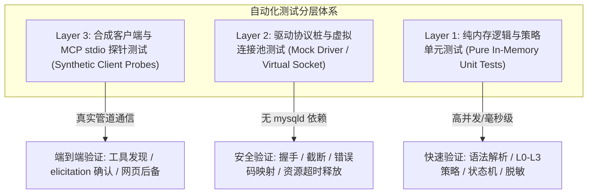

# 自动化测试分层与虚拟沙箱隔离规范 (Testing Strategy & Sandbox Isolation)

> 状态：测试体系基线；对应需求 R14、R16，对应特性 F26、F28，提供跨平台可复现、无真实外部数据库依赖的生产测试指南。

---

## 1. 核心安全红线 (Absolute Safety Boundaries)

1. **绝对禁止默认直连真实数据库**：
   - 自动化测试套件（Unit & Integration Tests）在本地及 CI 执行时，**严禁向任何真实外部 MySQL 服务器发起真实网络连接**。
   - 严禁在测试代码中硬编码任何真实主机名、数据库名、用户名或密码凭据。
2. **确定性与无副作用 (Determinism & Zero Side-Effects)**：
   - 测试必须在完全干净的环境中离线可运行，不依赖本地已安装的特定环境服务（如本地必须运行 mysqld 服务）。
   - 测试用例执行完毕后，不得在操作系统中遗留悬空进程、开放端口或未清理的持久化文件。
3. **CI 跨平台可复现性**：
   - 测试必须在 Windows 10/11 本地开发机与 GitHub Actions Ubuntu 最新 Runner 上均能稳定、快速通过，不得因操作系统平台差异产生非确定性行为。

---

## 2. 三层测试金字塔架构 (Testing Pyramid)

### Layer 1: 纯内存逻辑与策略单元测试 (In-Memory Unit Tests)
- **测试范畴**：
  - SQL 语法树解析与风险等级判别器（严格验证 [`SQL_POLICY_MATRIX.md`](./SQL_POLICY_MATRIX.md) 的 L0 ~ L3 行为）。
  - 审批状态机（10 种状态转移、版本冲突、到期失效、幂等拦截）。
  - 敏感数据脱敏过滤器（错误信息屏蔽、日志指纹计算）。
- **约束指标**：
  - 纯 CPU 内存计算，零文件系统 I/O，零网络调用；单个用例耗时控制在 5ms 以内，支持高密度批量覆盖。

### Layer 2: 驱动协议桩与虚拟连接池测试 (Mock Driver & Virtual Socket)
- **测试范畴**：
  - `mysql2` 连接池封装、动态数据库切换、有界测试连接、查询行数截断（`max_rows`）、断线重连与连接泄漏防护。
- **虚拟沙箱方案**：
  - 构建轻量级虚拟连接桩（`MockConnection` / `FakeSocket`）：
    - 模拟 MySQL 原生协议的握手包响应；
    - 针对测试传入的虚构 SQL，返回确定性的模拟包（`OkPacket`、`ResultSetHeader`、`RowDataPacket` 或 `ErrorPacket`）；
    - 模拟网络超时（Socket Hang）与连接强制关闭场景。
  - 彻底规避对真实 MySQL 守护进程的硬性依赖，消除测试端口冲突。

### Layer 3: 合成客户端与 MCP stdio 探针测试 (Synthetic Client Probes)
- **测试范畴**：
  - MCP stdio 进程启动、工具清单发现（`tools/list`）、请求派发与结果接收、原生挑战（elicitation）应答与网页后备跳转。
- **模拟方案**：
  - 派生子进程启动 MCP 桥接器，在内存中通过双向流管道与标准输入输出交互；
  - 模拟 AI 客户端发起规范与畸形 JSON-RPC 消息，验证协议解析的健壮性。

---

## 3. Windows 平台性能保障与防超时策略

在 Windows 平台上，频繁派生子进程与读写大量小文件极易触发杀毒软件实时防护与文件锁开销，从而导致执行时间呈数倍放大（此前治理套件在 Windows 上执行 68 项测试耗时达 105 秒）。

为确保业务测试不踩踏超时红线（如预设的 `timeout_ms`），必须坚决遵循以下准则：

1. **严禁在单测中频繁读写磁盘**：
   - 业务逻辑测试严禁为每个用例在磁盘上创建临时目录；所有中间配置和测试数据全部注入内存（In-Memory Map 或 Memory Stream）。
2. **用例级与套件级超时防线**：
   - 单个单元测试用例超时硬性限制为 5000ms；
   - 完整业务单元测试套件在 Windows 上的总执行耗时应控制在 30 秒以内。
3. **并发测试隔离原则**：
   - 共享内存对象必须随用随建，禁止跨用例共享可变全局状态，防止用例乱序并发执行时产生竞态污染。

---

## 4. 负面用例与边界断言要求

为确保安全门禁的真实拦截能力，**负面与异常测试用例占比不得低于 50%**，必须重点覆盖：

1. **注入与绕过负例**：
   - 混杂多语句分号的 SQL、带特异注释的 SQL、跨库访问前缀、未知异构语法。
2. **并发与状态冲突负例**：
   - 审批过期后尝试批准、连接配置发生变更后旧请求重放、同一请求多次重复点击批准。
3. **异常中断与资源控制负例**：
   - 查询超大结果集时的行数强截断、模拟连接中断时的 UNKNOWN 保守状态处理、未认证会话访问敏感接口拦截。
