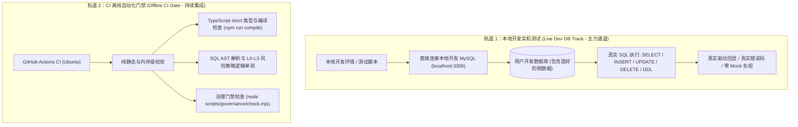

# 测试策略与开发环境假数据直连规范 (Testing Strategy & Dev Environment Specification)

> 状态：测试体系基线；对应需求 R14、R16，对应特性 F26、F28。经用户明确确认：**当前开发处于开发环境，目标数据库全为构造的假数据，可以随便用，明确不需要编写复杂的驱动 Mock 或自造测试数据**。

---

## 1. 核心定位与原则 (Core Principles)

1. **开发环境假数据直接使用 (Use Dev Database Freely)**：
   - 当前项目处于纯开发环境，用户本地的 MySQL 数据库内已填充开发专用的假数据（Dummy/Synthetic Data）。
   - **废除繁琐的 Mock Driver 协议桩要求**：本地开发与实机联调直接连接用户的本地开发 MySQL 实例，直接执行真实 SQL 查询、真实 DML 写入与 DDL 库表结构变更，无需耗费额外工程量自造 Mock 数据或构建虚拟协议套接字。
2. **生产安全与开发灵活解耦 (Prod Safety vs. Dev Flexibility)**：
   - 生产环境或未知外部数据库依然坚决遵循安全保护与二次审批原则；
   - 本地开发环境（`environment: "development"`）允许开发者在假数据库上随心读写，消除过度防御带来的联调阻碍。
3. **CI 流水线确定性与轻量离线运行 (Deterministic Offline CI)**：
   - 由于 GitHub Actions Ubuntu Runner 默认无常驻 MySQL 服务，自动化 CI 门禁仅运行无需外部网络连接的纯逻辑单元测试与 TypeScript 静态编译检查，确保远端流水线 100% 秒级稳定通过，绝不因缺少数据库服务报网络连接拒绝（`ECONNREFUSED`）。

---

## 2. 双轨测试模型 (Dual-Track Testing Architecture)

系统确立**“本地开发实机测试为主力，CI 离线门禁为底线”**的双轨架构：

### 轨道 1：本地开发实机测试 (Live Dev DB Track)
- **定位**：功能开发、端到端联调与驱动兼容性实测的主力通道。
- **配置方式**：
  - 通过本地管理页面或环境变量（如 `DEV_MYSQL_HOST`、`DEV_MYSQL_PORT`、`DEV_MYSQL_USER`、`DEV_MYSQL_DATABASE`）直接指定用户的本地开发库。
- **测试范畴**：
  - **真实连接与断连**：验证 `mysql2` 真实建立连接、网络超时、连接池管理；
  - **真实 SQL 执行**：在开发假数据库上直接测试 `SELECT` 行数截断、`INSERT` 自增主键获取、`UPDATE` 与 `DELETE` 条件生效、`CREATE/DROP TABLE` 结构变更；
  - **真实错误与脱敏**：故意执行非法语法或键冲突语句，捕获真实 MySQL 错误报文并验证脱敏过滤器有效性。
- **免 Mock 收益**：彻底规避了手写虚拟 `MockConnection` 或 `FakeSocket` 的高昂维护成本，直接以真实的 MySQL 8.x 响应为准。

### 轨道 2：CI 离线自动化门禁 (Offline CI Gate)
- **定位**：Pull Request 提交与主干合并时的质量与规范门禁。
- **测试范畴**：
  - TypeScript 严格类型与语法静态检查（`npm run compile`）；
  - 基于 `node-sql-parser` 的纯内存 AST 解析与策略路由单测（验证 L0~L3 判别规则，纯 CPU 计算，耗时毫秒级）；
  - 敏感信息掩蔽纯函数测试（验证连接串脱敏、路径脱敏逻辑）；
  - 治理门禁与交接链完整性检查。

---

## 3. Windows 平台性能保障策略

由于项目主干治理测试包含大量 Git 与多进程快照检查，在 Windows 平台上为避免 NTFS 文件系统与杀毒软件扫描造成的耗时放大，必须坚决遵循以下准则：

1. **避免单测中密集读写磁盘小文件**：
   - 纯逻辑单元测试严禁在每个用例中频繁创建与删除临时磁盘目录，中间配置统一注入内存（In-Memory Map）。
2. **超时阈值动态保障**：
   - 治理套件在 Windows 上的执行阈值已调优（`governance-tests` 240s，`collaboration-tests` 300s），后续业务测试单测控制在 5ms 级，保证套件执行流畅。

---

## 4. 边界与负面用例要求

无论在开发库实机测试还是离线单测中，负面与异常用例占比均不得低于 50%，以确保安全策略真实起效：

1. **语法与注入拦截负例**：
   - 混杂多语句分号的 SQL、跨库访问前缀、未知异构语法，必须在派发数据库前被策略引擎拦截并报错 `SQL_NOT_ALLOWED`。
2. **异常驱动错误负例**：
   - 针对假数据库触发外键约束、重复键、未知表名报错，验证服务端脱敏过滤器（`maskErrorMessage`）是否正确屏蔽了敏感物理信息。
