# 变更管理与发版台账规范 (Change Management & Release Ledger)

> **核心定位**：本文档库是项目各次任务交付的核心演进记录，具备**双重视角**：
> 1. **对 Agent**：作为任务开启时的强制必读上下文，沉淀高密度架构决策与避坑警示；
> 2. **对发版 (Release)**：作为标准变更碎片（Change Fragments），在版本发布时可直接一键聚合为对齐 GitHub Releases / CHANGELOG 风格的正式发版说明。

---

## 1. Agent 任务启动通读义务

所有接手本项目的 Agent（包括 Antigravity 与 PI-Desktop），在开启任何新任务（Planning / Implementation）前，**必须通读本目录下的所有活动未发版变更文档**。

### 为什么必须读？
- **消除会话失忆**：Agent 新会话没有历史记忆，通读未发版文档可瞬间掌握近期最新架构改动与技术上下文。
- **杜绝重复踩坑**：变更文档中详实记录了前人遇到的隐蔽 Bug、系统环境差异（如 Windows CRLF、CI 隔离、任务多选歧义等）及绝对禁忌事项。
- **保持架构对称**：避免新功能破坏刚刚建立的底层契约或治理约束。

---

## 2. 单篇变更文档标准结构契约 (Template)

每次任务完成修改并准备交付时，AI 必须在 `docs/changes/` 下创建独立的变更记录文件，命名格式：
`YYYY-MM-DD-TASK-<ID>-<slug>.md`（例如 `2026-10-02-TASK-GOV-005-change-management.md`）。

文档必须包含两大核心板块：

```markdown
# [TASK-ID] 变更标题（简明概述）

- 变更日期：YYYY-MM-DD
- 关联任务：TASK-xxx
- 关联 PR：[#x](https://github.com/ArturiaGit/mysql-mcp/pull/x)
- 关联 Commit：[`<commit-hash>`](https://github.com/ArturiaGit/mysql-mcp/commit/<commit-hash>)
- 责任执行方：Antigravity / PI-Desktop
- 关联功能/需求：Gxx, Rxx

---

## 📢 发版说明（Release Notes / 面向用户与下游）
> 此板块在发版时将被直接提取并聚合至正式 CHANGELOG / GitHub Release 说明中。

### 变更分类与追溯条目
- **🚀 Added**：
  - 新增特性描述 by @<作者> in [#<PR>](url) ([`<commit>`](url))
- **🔄 Changed**：
  - 调整或优化现有功能描述 by @<作者> in [#<PR>](url) ([`<commit>`](url))
- **⚠️ Breaking Changes**：
  - 说明破坏性改动及升级迁移指引
- **🐛 Fixed**：
  - 修复缺陷描述 by @<作者> in [#<PR>](url) ([`<commit>`](url))
- **🔒 Security**：
  - 安全加固与权限边界完善
- ** Deprecated**：
  - 废弃标记与计划替代方案

### 发版亮点摘要 (Highlights)
1-2 句通俗易懂的说明，直观说明本次修改带来的用户/开发者价值。

---

## 🛠️ Agent 工程上下文与架构演进（面向开发者与后续 Agent）
> 此板块供后续 Agent 在新任务启动时通读，建立技术深度与防御性约束。

### 1. 架构与设计决策 (Why & Design)
- 为什么要这么改？背后的方案选型与技术推导。

### 2. 实际改动文件与逻辑清单 (What)
- 新增文件及职责：...
- 修改文件及核心改动函数/逻辑：...
- 删除文件及清理原因：...

### 3. ⚠️ 对后续 Agent 的避坑指南与警示红线 (Caveats & Rules)
- **踩坑记录**：本次修复或实现中遇到的环境差异、隐蔽 Bug（如 Windows 换行符、CI 隔离等）。
- **必须遵循的约束**：后续任务绝对不能修改或必须遵守的事项。

### 4. 验证证据 (Verification)
- 本地执行的检查命令与测试结果、CI 独立验证状态。
```

---

## 3. 发版驱动的 AI 生命周期闭环

```mermaid
flowchart TD
    subgraph Iteration["日常任务迭代期 (Unreleased)"]
        T1["任务完成与交付"] --> C1["AI 撰写当次变更文档 docs/changes/YYYY-MM-DD-TASK-xxx.md"]
        C1 --> C2["回填真实 PR 链接与 Commit 链接"]
        C2 --> C3["登记到 docs/changes/README.md 未发版列表"]
        C3 --> T2["新任务启动：Agent 强制通读所有未发版变更文档"]
    end

    subgraph Release["发版时刻 (Release Time)"]
        R1["触发发版 (如发布 v0.1.0)"] --> R2["AI 扫描 docs/changes/ 下全部未发版文档"]
        R2 --> R3["提取各文档中的『📢 发版说明』条目（带 PR/Commit 链接）"]
        R3 --> R4["按分类自动聚合成 GitHub 风格的标准 Release Notes / CHANGELOG"]
        R4 --> R5["AI 将这批已发版变更文档整体移入 docs/changes/archive/vX.Y.Z/ 归档"]
        R5 --> R6["docs/changes/ 恢复清爽，重置未发版列表"]
    end
```



1. **日常迭代**：
   - 任务交付（`documentation_delivery`）时，AI 撰写当次变更文档，记录真实 PR 与 Commit 超链接；
   - 将文档加入下方【活动未发版变更列表 (Unreleased)】；
   - 新任务启动前通读本列表全部文档。
2. **版本发布 (Release)**：
   - 当触发版本发布（如 `v0.1.0`）时，AI 扫描全部未发版变更文档；
   - 提取各文档中的【📢 发版说明】板块，聚合生成 GitHub Releases / CHANGELOG 格式的发布日志；
   - 将这批变更文档整体归档至 `docs/changes/archive/vX.Y.Z/`，活动列表重置，保持目录轻量高信噪比。

---

## 4. 活动未发版变更列表 (Unreleased)

| 变更文档 | 关联任务 | PR | Commit | 核心亮点 |
|---|---|---|---|---|
| [TASK-GOV-001 规范基线与分支自动化流程](./2026-10-02-TASK-GOV-001-baseline-and-pr-flow.md) | TASK-GOV-001 | [#1](https://github.com/ArturiaGit/mysql-mcp/pull/1) | [`689f9ef`](https://github.com/ArturiaGit/mysql-mcp/commit/689f9ef) | 建立规范基线与 Agent 自动分支到 PR 流程 |
| [TASK-GOV-002 GitHub CI 继承环境隔离](./2026-10-02-TASK-GOV-002-ci-environment-isolation.md) | TASK-GOV-002 | [#2](https://github.com/ArturiaGit/mysql-mcp/pull/2) | [`c61f157`](https://github.com/ArturiaGit/mysql-mcp/commit/c61f157) | 隔离 CI 环境变量，防止测试污染与执行偏差 |
| [TASK-GOV-003 main 多任务基线匹配修复](./2026-10-02-TASK-GOV-003-main-task-selection-fix.md) | TASK-GOV-003 | [#3](https://github.com/ArturiaGit/mysql-mcp/pull/3) | [`ed631a2`](https://github.com/ArturiaGit/mysql-mcp/commit/ed631a2) | 精确识别 main Squash 合并增量，消除历史任务歧义 |
| [TASK-GOV-004 双 Agent 人工协作与交付门禁](./2026-10-02-TASK-GOV-004-antigravity-pi-handoff.md) | TASK-GOV-004 | [#4](https://github.com/ArturiaGit/mysql-mcp/pull/4) | [`b80bab2`](https://github.com/ArturiaGit/mysql-mcp/commit/b80bab2) | 建立 Antigravity × PI-Desktop 人工转交与机械交接闭环 |
| [TASK-GOV-005 变更管理与发版说明集成规约](./2026-10-02-TASK-GOV-005-change-management-specification.md) | TASK-GOV-005 | 待交付 | 待交付 | 建立 docs/changes/ 库，支持双重视角、必读入口与发版聚合 |

---

## 5. 历史版本归档索引 (Released Archives)

> 尚无正式已发布版本。当前所有历史任务均为未发版的治理基础建设，统一维护在活动未发版列表中。
